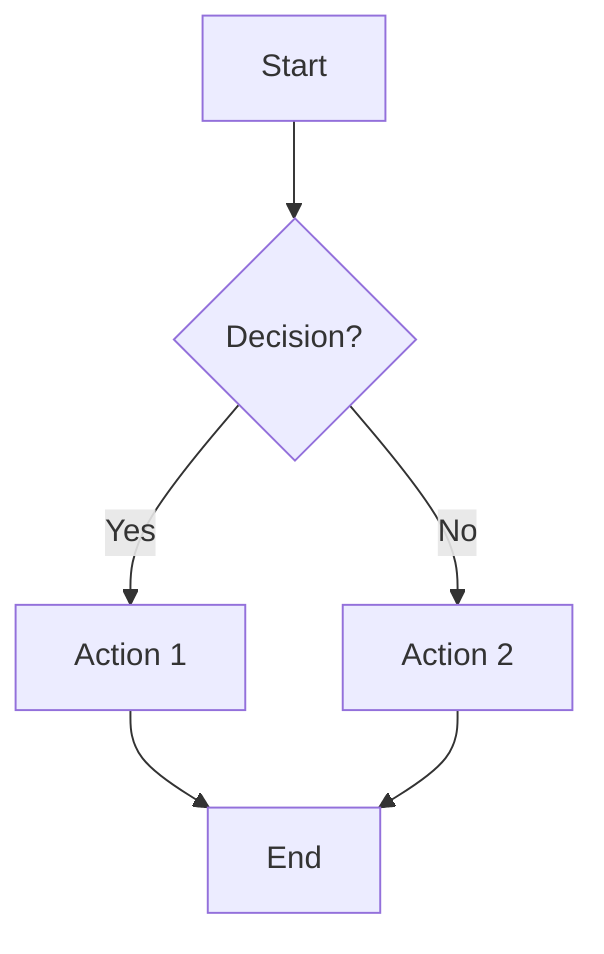

# 🚀 AI Team Quick Reference Card

## Session Startup Checklist

```
□ 1. Read .ai-team/team-history.md
□ 2. Read current spec (specs/features/XXX-name/spec.md)
□ 3. Check progress dashboard
□ 4. Review any blockers
□ 5. TL assigns tasks for session
```

---

## Role Abbreviations

| Full Name | Abbrev | Emoji |
|-----------|--------|-------|
| Team Leader | TL | 🎯 |
| UXUI Designer | UX | 🎨 |
| Frontend Developer | FE | 💻 |
| Backend Developer | BE | ⚙️ |
| API Developer | API | 🔌 |
| QA Engineer | QA | 🧪 |

---

## Vote Quick Guide

| Type | When | Quorum | Threshold |
|------|------|--------|-----------|
| **Quick** | Minor stuff | 3 | Simple majority |
| **Standard** | Architecture | 4 | ⅔ majority |
| **Critical** | Breaking changes | ALL 6 | Unanimous |

---

## Core Commands

```bash
# Initialize project
/init-team [project-name]

# Start session
/team-start

# End session
/team-end

# After feature complete
/team-evolve

# Quick vote
/vote quick "[topic]"

# Standard vote
/vote standard "[topic]"
```

---

## Test-Fix Loop

```
implement → test → pass? 
                   ├─ YES → done ✓
                   └─ NO  → fix → test (max 10x)
```

---

## Key Files

| File | Purpose | When to Read |
|------|---------|--------------|
| `.ai-team/team-history.md` | Team memory | EVERY session start |
| `specs/features/XXX/spec.md` | Current feature | Before ANY task |
| `specs/features/XXX/tasks.md` | Task breakdown | During implementation |
| `docs/UXUI/*.md` | Wireframes | Before UI implementation |

---

## Golden Rules

1. 📋 **BATCH** questions (min 3, then ask once)
2. ✅ **ALWAYS** read history first
3. ✅ **ALWAYS** read spec before task
4. ✅ **ALWAYS** update history after task
5. ✅ **ALWAYS** test → fix loop until pass
6. ✅ **ALWAYS** vote on internal decisions
7. ✅ **ALWAYS** propose features when spec complete
8. ❌ **NEVER** re-ask answered questions

---

## 🙋 Batched Questions Quick Guide

### When to Batch (Collect for Human)
- Spec ambiguities
- Business logic decisions
- User preferences
- External service choices

### When NOT to Batch (Team Decides)
- Technical implementation
- Code architecture
- Testing strategies
- Bug fix approaches

### Batch Flow
```
Collect Questions → Min 3 or End of Phase → 
Present ALL at Once → Record Answers → 
Proceed Autonomously
```

### Question Format
```markdown
Q1: [Category] - [Priority]
Question: [Clear question]
Options: A, B, C
Team Leans: [Preference]
```

---

## Session End Checklist

```
□ 1. Update team-history.md
□ 2. List completed tasks
□ 3. List in-progress tasks
□ 4. Document any blockers
□ 5. Set next session goals
```

---

## Emergency Protocols

**Stuck on test-fix loop (>10 iterations)?**
→ Escalate to Standard Vote: "Should we rethink approach?"

**Unanimous vote not reached (Critical)?**
→ After 3 rounds, choose safer option

**Conflict between roles?**
→ TL mediates → If unresolved, Standard Vote

**Spec is unclear?**
→ Team interprets together → Document interpretation → Proceed

---

## CLI Cheatsheet

```bash
# Google Cloud
gcloud auth login
gcloud run deploy SERVICE --source .
gcloud functions deploy FUNC

# Firebase
firebase init
firebase deploy
firebase serve

# Testing
npm test
npm run test:coverage

# Git
git checkout -b feature/XXX-name
git add . && git commit -m "..."
```

---

## Mermaid Quick Syntax



---

## Plaintext UXUI Template

```
┌─────────────────────────────────┐
│ Header                          │
├─────────────────────────────────┤
│                                 │
│  ┌─────────────────────────┐   │
│  │ Input Field             │   │
│  └─────────────────────────┘   │
│                                 │
│  [ Primary Button ]             │
│  [ Secondary Button ]           │
│                                 │
└─────────────────────────────────┘
```

---

## Task Status Icons

- ⬜ Not started
- 🔄 In progress
- ⏸️ Blocked
- ✅ Complete
- ❌ Failed/Needs redo

---

**Remember:** The team operates autonomously. When in doubt, vote it out! 🗳️
